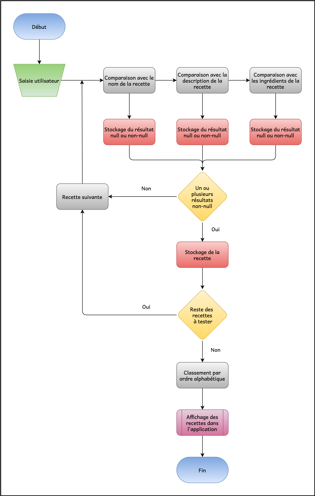
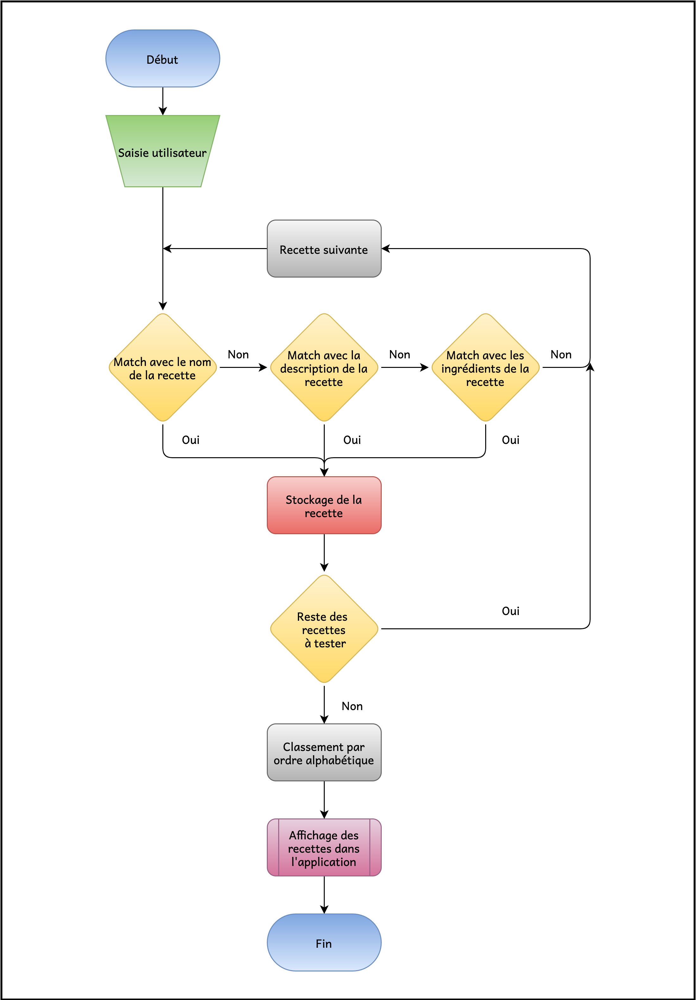
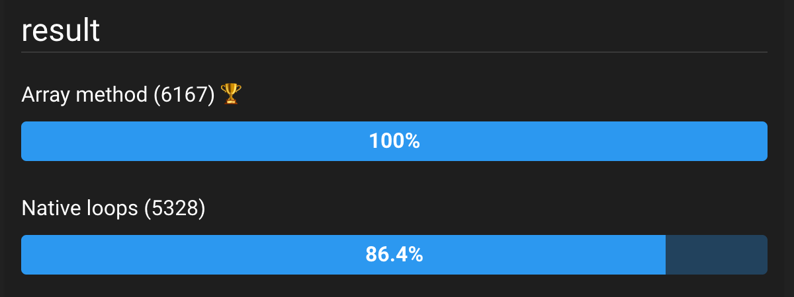

# 1. Les petit plats

Projet N°7 du parcours _Développeur Front-End_ [OpenClassrooms](https://openclassrooms.com/fr/).


***

<p align="center">

</p>

- [1. Les petit plats](#1-les-petit-plats)
  - [1.1. Premier algorithme (boucles natives)](#11-premier-algorithme-boucles-natives)
  - [1.2. Deuxième algorithme (Array method)](#12-deuxième-algorithme-array-method)
  - [1.3. Benchmark](#13-benchmark)
    - [1.3.1. Données communes](#131-données-communes)
    - [1.3.2. Boucles natives](#132-boucles-natives)
    - [1.3.3. Méthode d'objet Array](#133-méthode-dobjet-array)
    - [1.3.4. Résultat du benchmark](#134-résultat-du-benchmark)

***

## 1.1. Premier algorithme (boucles natives)

Afin d'organiser au mieux la gestion des tâches, le projet a été initialisé avec **Git-flow**.  
Le premier algorithme a donc été développé dans la branche [***search-by-loop-algorithm***](https://github.com/remymerienne/RemyMerienne_7_18052021/tree/feature/search-by-loop-algorithm) qui est la seule à ne pas avoir été _mergée_, cette solution n'ayant pas été retenue.

L'algorithme [***mainAlgorithm.js***](https://github.com/remymerienne/RemyMerienne_7_18052021/blob/feature/search-by-loop-algorithm/script/components/mainAlgorithm.js) est fonctionnel pour la recherche principale, l'affichage (non responsive) des recettes et la mise à jour des listes d'ingrédients, d'appareils et d'ustensiles.

***

## 1.2. Deuxième algorithme (Array method)

Cet algorithme (utilisé pour la version v1.0.0) est pleinement fonctionnel.
- Recherche principale
- Affinage de la recherche avec saisie préalable dans les listes d'ingrédients, d'appareils et d'ustensiles
- Affinage de la recherche grâce à la selection directe d'un item dans les listes d'ingrédients, d'appareils et d'ustensiles
- Affiche full responsive
- Code CSS et HTML valide **W3C**

***

## 1.3. Benchmark

Afin d'assurer un résultat fiable du benchmark, le test des deux modes de recherche a été standardisé.  
Nous simulons la recherche du mot 'Crème' et allons rechercher des correspondances dans les noms de recettes, dans les descriptions et dans les ingrédients.  
Les recettes sélectionnées seront triées par ordre alphabétique et stockées dans un tableau nommé `recipesFound`.

C'est sur le site [***jsbench.ch***](https://jsben.ch/) que le test a été effectué.

### 1.3.1. Données communes

Le premier block contient les éléments communs aux deux algorithmes.


Il s'y trouve :

- le tableau `recipes` contenant la totalité des recettes.
- La fonction `formatString()` permettant de standardiser la saisie utilisateur ainsi que les termes contenus dans `recipes` :

```js
const formatString = (string) => {
  string = string.toLowerCase();
  string = string.replace(/[éèëê]/g, 'e');
  string = string.replace(/[îï]/g, 'i');
  string = string.replace(/[àâ]/g, 'a');
  string = string.replace(/[ç]/g, 'c');
  return string;
};
```

- La fonction de comparaison `byName()` pour classer les recettes :
  
```js
const byName = (a, b) => {
  if (a.name < b.name) {
    return -1;
  }
  if (a.name > b.name) {
    return 1;
  }
  return 0;
};
```

- La variable contenant la recherche à effectuer et le tableau devant recevoir les résultats :

```js
let userSearch = formatString('Crème');
userSearch = new RegExp('\\b' + userSearch, 'gi');

let recipesFound = [];
```

_Notes : La saisie utilisateur est convertie en expression régulière car elle sera assignée à la méthode `match()` de l'objet `string`. Cette méthode a été choisie afin d'avoir une correspondance de recherche par mot-clé et non par partie incluse dans un mot qui isolément ne signifie rien._

### 1.3.2. Boucles natives

La premiere modélisation concerne la version développée avec les boucles natives de **JavaScript**.

```js
(() => {

  for (let i in recipes) {

    const recipeTested = recipes[i];

    const recipeName = formatString(recipeTested.name);
    const testResultByName = recipeName.match(userSearch);

    const recipeDescription = formatString(recipeTested.description);
    const testResultByDescription = recipeDescription.match(userSearch);

    const ingredients = recipeTested.ingredients;
    let testResultByIngredient;
    for (let i in ingredients) {
      const recipeIngredient = formatString(ingredients[i].ingredient);
      testResultByIngredient = recipeIngredient.match(userSearch);
      if (testResultByIngredient !== null) {
        break;
      }
    }

    if (testResultByName !== null || testResultByDescription !== null || testResultByIngredient !== null) {
      recipesFound.push(recipeTested);
    }

  }

  recipesFound = recipesFound.sort(byName);

})();
```

Algorigramme :



### 1.3.3. Méthode d'objet Array

La deuxième modélisation concerne la version développée avec les méthodes de l'objet `Array` de **JavaScript**.

```js
(() => {

  const filterRecipes = (recipe) => {
    if (formatString(recipe.name).match(userSearch) !== null) {
      return true;
    } else if (formatString(recipe.description).match(userSearch) !== null) {
      return true;
    } else {
      for (let i in recipe.ingredients) {
        if (formatString(recipe.ingredients[i].ingredient).match(userSearch) !== null) {
          return true;
        }
      }
      return false;
    }
  };

  recipesFound = recipes.filter(filterRecipes).sort(byName);

})();
```

Algorigramme :



### 1.3.4. Résultat du benchmark

L'algorithme de recherche développé avec les méthodes de l'objet `Array` s'avère plus performant de 13.6% avec un score de 6167 opérations/s contre 5328 o/s pour le premier algorithme.



_Voir [**Fiche d'inverstigation de fonctionnalité**](./supply/algorigramme/Fiche-investigation.pdf)_

***


